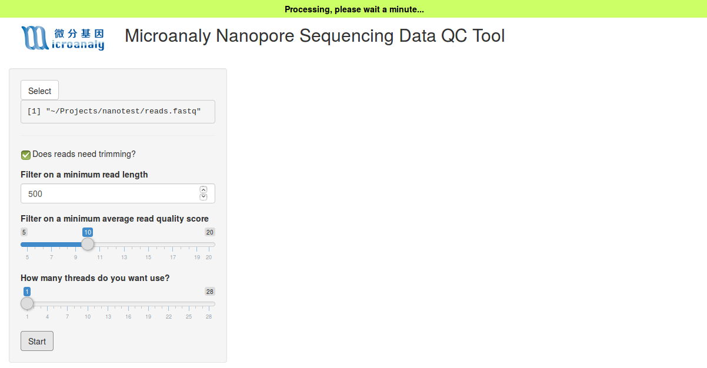
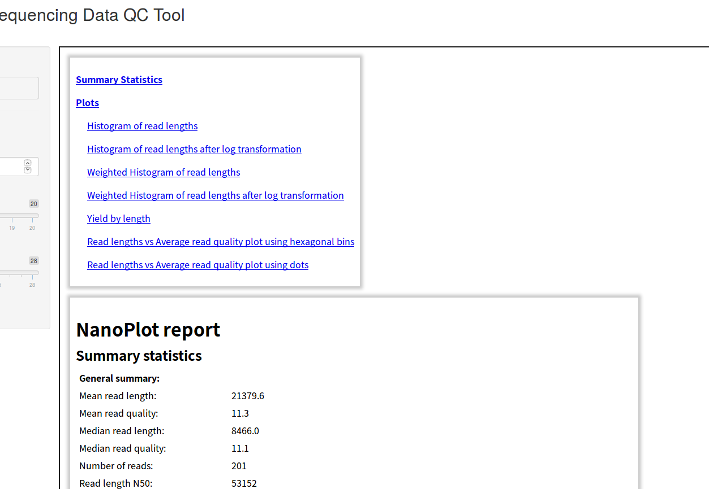

 

# NanoQC

## Introduction

NanoQC is a shiny app used for preprocessing [Oxford Nanopore](https://nanoporetech.com/) sequencing data. This app simply consists of two parts:

1. Trimming
    + Adapter trimming: in order to improve downstream analysis, we apply  to trim adapter sequence.
    + Quality trimming: the read qualities from third generation sequencing experiments are usually lower than from next generation sequencing experiments, quality trimming becomes inevitable. Here,  is applied to filter reads with average quality score lower than cutoff and reads with too-short length.
        
2. Summarization

To provide read-length distribution, quality distribution and other useful information to users, we apply [NanoPlot](https://github.com/wdecoster/nanoplot) to calculate these quantities and generate a simple report.

## How to use this app

#### Install required software environments and related packages

+ R ( >= 3.4)

+ Shiny and [shinyFiles](https://github.com/thomasp85/shinyFiles)

+ [Porechop](https://github.com/rrwick/Porechop)

+ Python ( >= 3.5)

+ [NanoFilt](https://github.com/wdecoster/nanofilt)

+ [NanoPlot](https://github.com/wdecoster/NanoPlot)

#### Launch this app

Once you've installed necessary softwares and packages, you could launch this app in R console or in Rstudio environment.

+ Launch

+ Running stage

+ Job finished

#### Contact us

If you encounter any trouble or have any question about this app, please contact with me any time.

My email address is chiachun[dot]chiu[at]gmail[dot]com .
